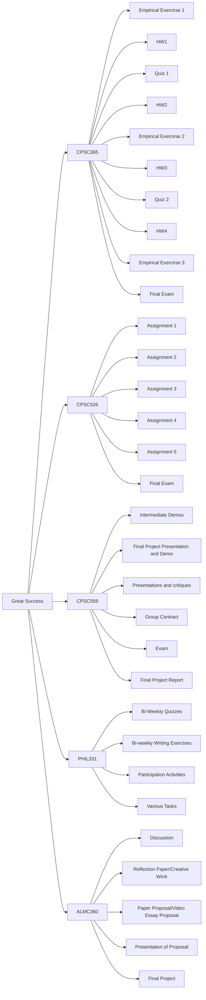

# Winter 2025 Assessments

```mermaid
graph LR
    Root[Great Success]

    Root --> CPSC365
    CPSC365 --> 1[Empirical Exercirse 1]
    CPSC365 --> 2[HW1]
    CPSC365 --> 3[Quiz 1]
    CPSC365 --> 4[HW2]
    CPSC365 --> 5[Empirical Exercirse 2]
    CPSC365 --> 6[HW3]
    CPSC365 --> 7[Quiz 2]
    CPSC365 --> 8[HW4]
    CPSC365 --> 9[Empirical Exercirse 3]
    CPSC365 --> 10[Final Exam]
    
    Root --> CPSC526
    CPSC526 --> 11[Assignment 1]
    CPSC526 --> 12[Assignment 2]
    CPSC526 --> 13[Assignment 3]
    CPSC526 --> 14[Assignment 4]
    CPSC526 --> 15[Assignment 5]
    CPSC526 --> 16[Final Exam]
    
    Root --> CPSC559
    CPSC559 --> 21[Intermediate Demos]
    CPSC559 --> 22[Final Project Presentation and Demo]
    CPSC559 --> 23[Presentations and critiques]
    CPSC559 --> 24[Group Contract]
    CPSC559 --> 25[Exam]
    CPSC559 --> 26[Final Project Report]
    
    Root --> PHIL331
    PHIL331 --> 31[Bi-Weekly Quizzes]
    PHIL331 --> 32[Bi-weekly Writing Exercises]
    PHIL331 --> 33[Participation Activities]
    PHIL331 --> 34[Various Tasks]
    
    Root --> ALMC360
    ALMC360 --> 41[Discussion]
    ALMC360 --> 42[Reflection Paper/Creative Work]
    ALMC360 --> 43[Paper Proposal/Video Essay Proposal]
    ALMC360 --> 44[Presentation of Proposal]
    ALMC360 --> 45[Final Project]
```